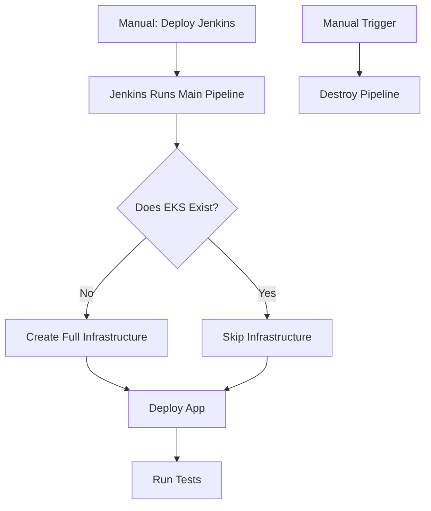

# Sample Flask App

This repository contains a sample Flask application and Terraform configurations for deploying a DevOps 3-tier architecture.

---

## Application (Sample App)

The application structure is as follows:

```
app/
├── Dockerfile
├── requirements.txt
├── app.py
├── prometheus_monitoring.py
└── wsgi.py
```


### Build and Push the Docker Image

1. **Log in to AWS ECR**:
   ```bash
   aws ecr get-login-password | docker login --username AWS --password-stdin <your_account_id>.dkr.ecr.<region>.amazonaws.com

2. Tag the Docker Image:
`docker tag flask-test-app:latest <your_account_id>.dkr.ecr.<region>.amazonaws.com/flask-test-app:latest`

3. `docker push <your_account_id>.dkr.ecr.<region>.amazonaws.com/flask-test-app`
Note: Create the ECR repository manually with the name flask-test-app before pushing the image.

## Minimal Deployment with Terraform Locally to Set Up Jenkins
Steps:
Navigate to the Terraform directory:
1. 
`cd infra/`

2. 
`terraform init`

3. plan changes
`terraform plan -target=module.network -target=module.jenkins -target=module.bastion`
Note: This raises an issue because the NAT gateway takes time to provision, causing Jenkins server dependencies to fail during installation.

4. Apply changes:
`terraform apply -target=module.network -target=module.jenkins -target=module.bastion -auto-approve`

## Alternative Deployment Strategy
Option 1: Add depends_on to the Jenkins Module
Add the depends_on argument to the Jenkins module in main.tf to ensure the NAT gateway is provisioned before Jenkins is deployed. You can then run the commands in steps 3 and 4 above.

### Option 2: Deploy in Two Steps
1. Deploy the network first:
`terraform apply -target=module.network -auto-approve`
2. Deploy Jenkins and the bastion host:
`terraform apply -target=module.jenkins -target=module.bastion -auto-approve`

## Accessing the Jenkins Server
Since the Jenkins server is in a private subnet, access it via the bastion host:

1. Copy the key pair to the bastion host:
`scp -i jenkins_server.pem jenkins_server.pem ec2-user@<bastion_public_ip>:~/jenkins_server.pem`

2. 
`ssh -i jenkins_server.pem ec2-user@<bastion_public_ip>`

3. 
`ssh -i jenkins_server.pem ubuntu@<jenkins_private_ip>`

4. 
`sudo cat /var/lib/jenkins/secrets/initialAdminPassword`

## Jenkins Configuration
### Install Plugins:
- Docker
- AWS
- Git
- SSH Agent
- Pipeline
- AWS Step
- Terraform
### Install Terraform on Jenkins Server:
Manually install Terraform on the Jenkins server to enable infrastructure deployment.

### Deployment Workflow
The deployment workflow is as follows:


### Errors Encountered
#### Issue: Jenkins Server Not Communicating with EKS
This occurs because Jenkins is in a public subnet, while EKS is set to private mode (industry and security standard).

#### Fix:
##### Option 1: Move Jenkins Server to a Private Subnet
Move the Jenkins server to a private subnet that has a route to a NAT gateway. This allows the Jenkins server to access the EKS API endpoint.
```module "jenkins" {
  source         = "./modules/jenkins"
  env            = var.env
  vpc_id         = module.network.vpc_id
  private_subnets = module.network.private_subnets # Use private subnets
  key_name       = var.key_name
  cluster_name   = module.eks.cluster_name
  bastion_sg_id  = module.bastion.security_group_id
  vpc_cidr       = var.vpc_cidr
}
```

##### Option 2: Enable Public Access for the EKS API Endpoint
Update the IAM role to include eks:UpdateClusterConfig.

Enable public access for the EKS API endpoint:
`aws eks update-cluster-config --name dev-devsecops-cluster --region us-east-1 --resources-vpc-config endpointPublicAccess=true`

Restrict public access to the Jenkins server's public IP or CIDR block:
`aws eks update-cluster-config --name dev-devsecops-cluster --region us-east-1 --resources-vpc-config publicAccessCidrs=<jenkins_public_ip>/32`
