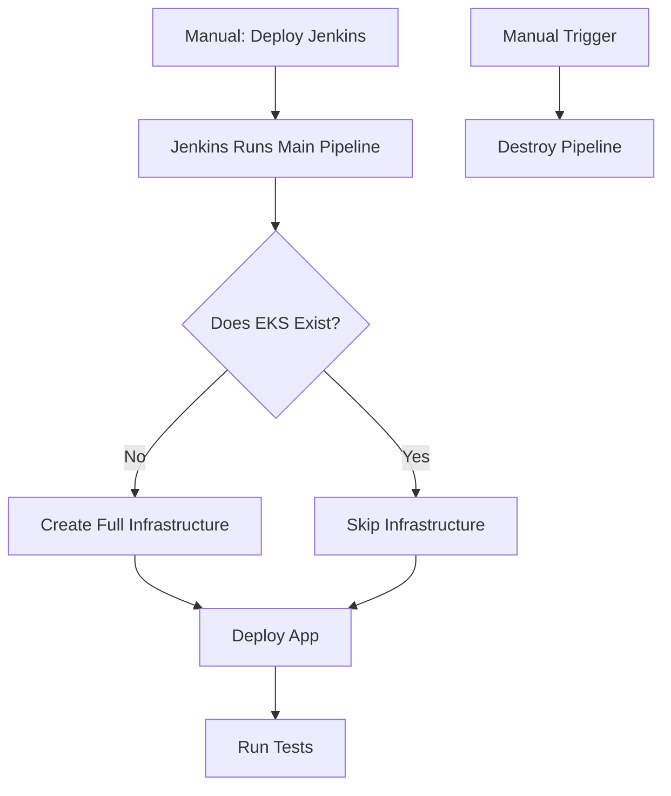

# sample_flask_app
for devops 3 tier application

## application (sample app)
```
app/
├── Dockerfile
├── requirements.txt
├── app.py
├── prometheus_monitoring.py
└── wsgi.py
```

build the app and register to docker hub or amazon ecr

```bash
# Log in to AWS ECR
aws ecr get-login-password | docker login --username AWS --password-stdin 148761635167.dkr.ecr.us-east-1.amazonaws.com

# Tag the Docker image for ECR
docker tag flask-test-app:latest 148761635167.dkr.ecr.us-east-1.amazonaws.com/flask-test-app:latest
```

docker push 148761635167.dkr.ecr.us-east-1.amazonaws.com/flask-test-app # create the repo manually with this name before you push`

## Doing a minimal deployment with terraform locally to get jenkins setup.
i created a jenkins file to deploy just jenkins server "jenkins-only.tf"
then i will use this server to deploy the whole architecture

1. Navigate to the directory:  
   `cd infra/`  
2. Initialize Terraform:  
   `terraform init`  
3. Plan changes:  
   `terraform plan -target=module.network -target=module.jenkins -target=module.bastion`  
4. Apply changes:  
   `terraform apply -target=module.network -target=module.jenkins -target=module.bastion -auto-approve`

accessing the Jenkins server will be via the bastion server.

#### Things to do === DO NOT DO THESE SINCE USER_DATA.SH FILE HAS IT DONE ALREADY.
---On Jenkins server---
`sudo usermod -aG docker jenkins`
`sudo systemctl restart jenkins`
--- also install terraform ---
https://developer.hashicorp.com/terraform/tutorials/aws-get-started/install-cli

Install plugins:
Docker, AWS, Git, SSH Agent, Pipeline, AWS step, Terraform
You will eqully have to install terraform on jenkins server manually

update jenkins file to updated segurity group for jenkins. (to avoid duplication)
by importing the jenkins SG, and role.


deployment is like this 



## ERRORS ENCOUNTERED
#### JENKINS SERVER NOT COMMUNICATING WITH EKS
this is due to the fact that jenkins is in public subnet and  EKS set for private mode (industry and security standard). 

#### fix
Option 1: Move Jenkins Server to a Private Subnet
To resolve the issue, move the Jenkins server to a private subnet that has a route to a NAT gateway. This will allow the Jenkins server to access the EKS API endpoint.

```
module "jenkins" {
  source         = "./modules/jenkins"
  env            = var.env
  vpc_id         = module.network.vpc_id
  private_subnets = module.network.private_subnets # Use private subnets
  key_name       = var.key_name
  cluster_name   = module.eks.cluster_name
  bastion_sg_id  = module.bastion.security_group_id
  vpc_cidr       = var.vpc_cidr
}
```

option 2: Enable Public Access for the EKS API Endpoint
(will need to update iam role to include eks:UpdateClusterConfig)
`aws eks update-cluster-config --name dev-devsecops-cluster --region us-east-1 --resources-vpc-config endpointPublicAccess=true`
Restrict public access to the Jenkins server's public IP or CIDR block:
`aws eks update-cluster-config --name dev-devsecops-cluster --region us-east-1 --resources-vpc-config publicAccessCidrs=<jenkins_public_ip>/32`

### going with option 1